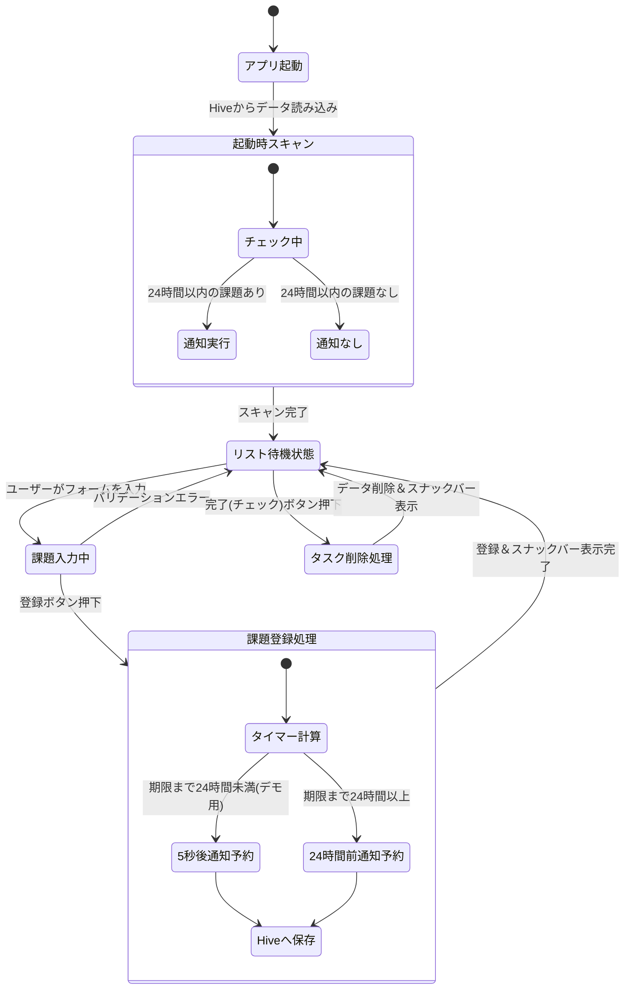
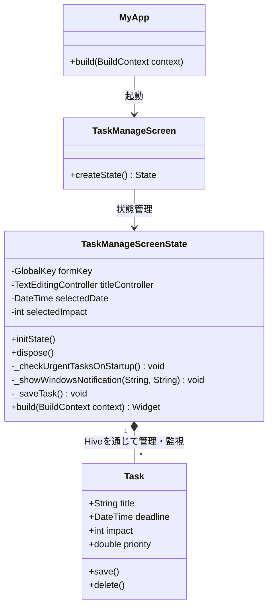

# 課題の優先度管理アプリ (デスクトップ版)

## 📌 アプリの概要
提出期限と影響度から「今やるべき課題」を自動計算し、優先順位をリアルタイムで提示するWindows常駐型アプリです。
アプリを閉じている間の通知漏れを防ぐため、起動時スキャン機能も実装しています。

## 🔄 状態遷移図 (State Machine Diagram)

## 🏗️ クラス図 (Class Diagram)
